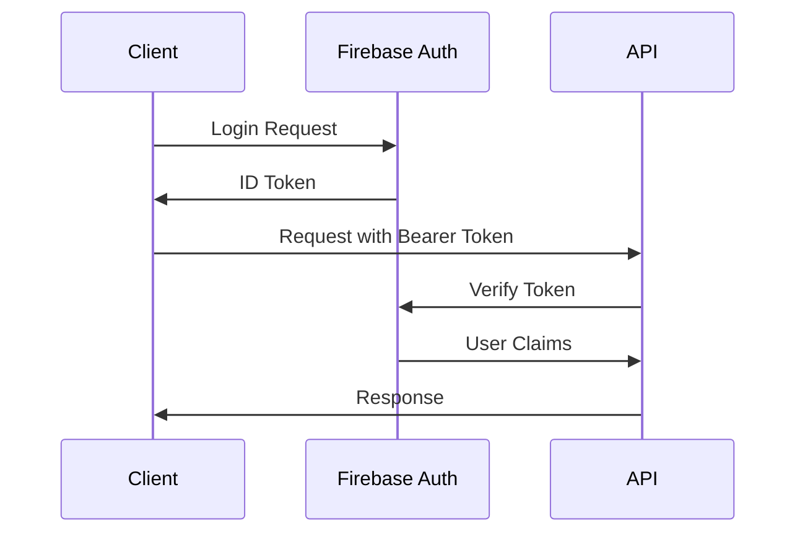

# API Reference Documentation
## Campus Lost & Found Application

### Table of Contents
1. [API Overview](#api-overview)
2. [Authentication](#authentication)
3. [Base URLs and Endpoints](#base-urls-and-endpoints)
4. [Request/Response Format](#requestresponse-format)
5. [Error Handling](#error-handling)
6. [Rate Limiting](#rate-limiting)
7. [User Management API](#user-management-api)
8. [Report Management API](#report-management-api)
9. [Search and Filter API](#search-and-filter-api)
10. [Messaging API](#messaging-api)
11. [File Upload API](#file-upload-api)
12. [Notification API](#notification-api)
13. [Analytics API](#analytics-api)
14. [Admin API](#admin-api)
15. [WebSocket API](#websocket-api)
16. [SDK Documentation](#sdk-documentation)
17. [Code Examples](#code-examples)

---

## API Overview

### Architecture
The Campus Lost & Found API is built on Firebase services and provides RESTful endpoints for mobile and web applications. The API follows REST principles and uses JSON for data exchange.

### Supported Platforms
- **Mobile**: iOS, Android (Flutter)
- **Web**: Progressive Web App (Flutter Web)
- **Desktop**: Windows, macOS, Linux (Flutter Desktop)

### API Versions
- **Current Version**: v1.0
- **Supported Versions**: v1.0
- **Deprecation Policy**: 6 months notice for breaking changes

---

## Authentication

### Firebase Authentication
The API uses Firebase Authentication for user management and security.

#### Supported Authentication Methods
- **Email/Password**: Traditional email and password authentication
- **Google Sign-In**: OAuth 2.0 with Google
- **Phone Authentication**: SMS-based verification
- **Anonymous Authentication**: Temporary anonymous sessions

#### Authentication Flow


#### Token Format
```http
Authorization: Bearer <firebase_id_token>
```

#### Token Validation
```javascript
// Example token validation
const admin = require('firebase-admin');

async function verifyToken(idToken) {
  try {
    const decodedToken = await admin.auth().verifyIdToken(idToken);
    return decodedToken;
  } catch (error) {
    throw new Error('Invalid token');
  }
}
```

---

## Base URLs and Endpoints

### Environment URLs
```
Development:  https://dev-api.campus-lf.edu/v1
Testing:      https://test-api.campus-lf.edu/v1
Staging:      https://staging-api.campus-lf.edu/v1
Production:   https://api.campus-lf.edu/v1
```

### Endpoint Categories
- `/auth/*` - Authentication endpoints
- `/users/*` - User management
- `/reports/*` - Lost/Found reports
- `/search/*` - Search and filtering
- `/messages/*` - Messaging system
- `/files/*` - File upload/download
- `/notifications/*` - Push notifications
- `/analytics/*` - Usage analytics
- `/admin/*` - Administrative functions

---

## Request/Response Format

### Request Headers
```http
Content-Type: application/json
Authorization: Bearer <firebase_id_token>
X-Client-Version: 1.0.0
X-Platform: ios|android|web|desktop
```

### Response Format
```json
{
  "success": true,
  "data": {
    // Response data
  },
  "message": "Operation completed successfully",
  "timestamp": "2024-01-15T10:30:00Z",
  "requestId": "req_123456789"
}
```

### Error Response Format
```json
{
  "success": false,
  "error": {
    "code": "VALIDATION_ERROR",
    "message": "Invalid input parameters",
    "details": {
      "field": "email",
      "reason": "Invalid email format"
    }
  },
  "timestamp": "2024-01-15T10:30:00Z",
  "requestId": "req_123456789"
}
```

---

## Error Handling

### HTTP Status Codes
- `200` - Success
- `201` - Created
- `400` - Bad Request
- `401` - Unauthorized
- `403` - Forbidden
- `404` - Not Found
- `409` - Conflict
- `422` - Unprocessable Entity
- `429` - Too Many Requests
- `500` - Internal Server Error
- `503` - Service Unavailable

### Error Codes
```javascript
const ERROR_CODES = {
  // Authentication Errors
  INVALID_TOKEN: 'INVALID_TOKEN',
  TOKEN_EXPIRED: 'TOKEN_EXPIRED',
  INSUFFICIENT_PERMISSIONS: 'INSUFFICIENT_PERMISSIONS',
  
  // Validation Errors
  VALIDATION_ERROR: 'VALIDATION_ERROR',
  MISSING_REQUIRED_FIELD: 'MISSING_REQUIRED_FIELD',
  INVALID_FORMAT: 'INVALID_FORMAT',
  
  // Resource Errors
  RESOURCE_NOT_FOUND: 'RESOURCE_NOT_FOUND',
  RESOURCE_ALREADY_EXISTS: 'RESOURCE_ALREADY_EXISTS',
  RESOURCE_CONFLICT: 'RESOURCE_CONFLICT',
  
  // Rate Limiting
  RATE_LIMIT_EXCEEDED: 'RATE_LIMIT_EXCEEDED',
  
  // Server Errors
  INTERNAL_ERROR: 'INTERNAL_ERROR',
  SERVICE_UNAVAILABLE: 'SERVICE_UNAVAILABLE'
};
```

---

## Rate Limiting

### Rate Limits
- **Authenticated Users**: 1000 requests per hour
- **Anonymous Users**: 100 requests per hour
- **File Uploads**: 50 uploads per hour
- **Search Requests**: 500 requests per hour

### Rate Limit Headers
```http
X-RateLimit-Limit: 1000
X-RateLimit-Remaining: 999
X-RateLimit-Reset: 1642248000
X-RateLimit-Window: 3600
```

### Rate Limit Response
```json
{
  "success": false,
  "error": {
    "code": "RATE_LIMIT_EXCEEDED",
    "message": "Rate limit exceeded. Try again in 3600 seconds.",
    "retryAfter": 3600
  }
}
```

---

## User Management API

### Get Current User Profile
```http
GET /users/me
Authorization: Bearer <token>
```

**Response:**
```json
{
  "success": true,
  "data": {
    "uid": "user123",
    "email": "john.doe@university.edu",
    "displayName": "John Doe",
    "photoURL": "https://example.com/photo.jpg",
    "phoneNumber": "+1234567890",
    "emailVerified": true,
    "role": "student",
    "department": "Computer Science",
    "studentId": "CS2024001",
    "preferences": {
      "notifications": true,
      "emailAlerts": false,
      "language": "en"
    },
    "createdAt": "2024-01-01T00:00:00Z",
    "lastLoginAt": "2024-01-15T10:30:00Z"
  }
}
```

### Update User Profile
```http
PUT /users/me
Authorization: Bearer <token>
Content-Type: application/json

{
  "displayName": "John Smith",
  "phoneNumber": "+1234567890",
  "department": "Computer Science",
  "preferences": {
    "notifications": true,
    "emailAlerts": true
  }
}
```

**Response:**
```json
{
  "success": true,
  "data": {
    "uid": "user123",
    "displayName": "John Smith",
    "phoneNumber": "+1234567890",
    "department": "Computer Science",
    "preferences": {
      "notifications": true,
      "emailAlerts": true,
      "language": "en"
    },
    "updatedAt": "2024-01-15T10:30:00Z"
  }
}
```

### Upload Profile Picture
```http
POST /users/me/photo
Authorization: Bearer <token>
Content-Type: multipart/form-data

photo: <file>
```

**Response:**
```json
{
  "success": true,
  "data": {
    "photoURL": "https://storage.googleapis.com/campus-lf/profile_pictures/user123/photo.jpg",
    "uploadedAt": "2024-01-15T10:30:00Z"
  }
}
```

### Delete User Account
```http
DELETE /users/me
Authorization: Bearer <token>
```

**Response:**
```json
{
  "success": true,
  "message": "User account deleted successfully"
}
```

---

## Report Management API

### Create New Report
```http
POST /reports
Authorization: Bearer <token>
Content-Type: application/json

{
  "itemName": "iPhone 13 Pro",
  "status": "lost",
  "description": "Black iPhone 13 Pro with blue case",
  "location": "Library",
  "category": "Electronics",
  "contactInfo": {
    "email": "john.doe@university.edu",
    "phone": "+1234567890"
  },
  "images": [
    "https://storage.googleapis.com/campus-lf/report_images/image1.jpg"
  ]
}
```

**Response:**
```json
{
  "success": true,
  "data": {
    "reportId": "report_123456",
    "uid": "user123",
    "itemName": "iPhone 13 Pro",
    "status": "lost",
    "description": "Black iPhone 13 Pro with blue case",
    "location": "Library",
    "category": "Electronics",
    "contactInfo": {
      "email": "john.doe@university.edu",
      "phone": "+1234567890"
    },
    "images": [
      "https://storage.googleapis.com/campus-lf/report_images/image1.jpg"
    ],
    "timestamp": "2024-01-15T10:30:00Z",
    "createdAt": "2024-01-15T10:30:00Z",
    "updatedAt": "2024-01-15T10:30:00Z"
  }
}
```

### Get Report by ID
```http
GET /reports/{reportId}
Authorization: Bearer <token>
```

**Response:**
```json
{
  "success": true,
  "data": {
    "reportId": "report_123456",
    "uid": "user123",
    "itemName": "iPhone 13 Pro",
    "status": "lost",
    "description": "Black iPhone 13 Pro with blue case",
    "location": "Library",
    "category": "Electronics",
    "contactInfo": {
      "email": "john.doe@university.edu",
      "phone": "+1234567890"
    },
    "images": [
      "https://storage.googleapis.com/campus-lf/report_images/image1.jpg"
    ],
    "timestamp": "2024-01-15T10:30:00Z",
    "createdAt": "2024-01-15T10:30:00Z",
    "updatedAt": "2024-01-15T10:30:00Z",
    "views": 25,
    "matches": 3
  }
}
```

### Update Report
```http
PUT /reports/{reportId}
Authorization: Bearer <token>
Content-Type: application/json

{
  "description": "Updated description with more details",
  "status": "recovered",
  "location": "Library - Second Floor"
}
```

**Response:**
```json
{
  "success": true,
  "data": {
    "reportId": "report_123456",
    "description": "Updated description with more details",
    "status": "recovered",
    "location": "Library - Second Floor",
    "updatedAt": "2024-01-15T11:00:00Z"
  }
}
```

### Delete Report
```http
DELETE /reports/{reportId}
Authorization: Bearer <token>
```

**Response:**
```json
{
  "success": true,
  "message": "Report deleted successfully"
}
```

### Get User's Reports
```http
GET /reports/my-reports?page=1&limit=20&status=lost
Authorization: Bearer <token>
```

**Response:**
```json
{
  "success": true,
  "data": {
    "reports": [
      {
        "reportId": "report_123456",
        "itemName": "iPhone 13 Pro",
        "status": "lost",
        "location": "Library",
        "category": "Electronics",
        "timestamp": "2024-01-15T10:30:00Z",
        "views": 25,
        "matches": 3
      }
    ],
    "pagination": {
      "page": 1,
      "limit": 20,
      "total": 1,
      "totalPages": 1,
      "hasNext": false,
      "hasPrev": false
    }
  }
}
```

---

## Search and Filter API

### Search Reports
```http
GET /search/reports?q=iPhone&location=Library&category=Electronics&status=lost&sort=date&order=desc&page=1&limit=20
Authorization: Bearer <token>
```

**Query Parameters:**
- `q` - Search query (item name, description)
- `location` - Filter by location
- `category` - Filter by category
- `status` - Filter by status (lost, found, recovered)
- `sort` - Sort by (date, relevance, views)
- `order` - Sort order (asc, desc)
- `page` - Page number
- `limit` - Results per page

**Response:**
```json
{
  "success": true,
  "data": {
    "results": [
      {
        "reportId": "report_123456",
        "itemName": "iPhone 13 Pro",
        "status": "lost",
        "description": "Black iPhone 13 Pro with blue case",
        "location": "Library",
        "category": "Electronics",
        "images": [
          "https://storage.googleapis.com/campus-lf/report_images/image1.jpg"
        ],
        "timestamp": "2024-01-15T10:30:00Z",
        "relevanceScore": 0.95,
        "matchType": "exact"
      }
    ],
    "pagination": {
      "page": 1,
      "limit": 20,
      "total": 1,
      "totalPages": 1,
      "hasNext": false,
      "hasPrev": false
    },
    "filters": {
      "locations": ["Library", "Cafeteria", "Gym"],
      "categories": ["Electronics", "Clothing", "Books"],
      "statuses": ["lost", "found", "recovered"]
    }
  }
}
```

### Get Search Suggestions
```http
GET /search/suggestions?q=iPh
Authorization: Bearer <token>
```

**Response:**
```json
{
  "success": true,
  "data": {
    "suggestions": [
      "iPhone",
      "iPhone 13",
      "iPhone 13 Pro",
      "iPhone case",
      "iPhone charger"
    ]
  }
}
```

### Advanced Search
```http
POST /search/advanced
Authorization: Bearer <token>
Content-Type: application/json

{
  "query": "iPhone",
  "filters": {
    "location": ["Library", "Cafeteria"],
    "category": ["Electronics"],
    "status": ["lost"],
    "dateRange": {
      "start": "2024-01-01T00:00:00Z",
      "end": "2024-01-31T23:59:59Z"
    },
    "priceRange": {
      "min": 100,
      "max": 1000
    }
  },
  "sort": {
    "field": "relevance",
    "order": "desc"
  },
  "pagination": {
    "page": 1,
    "limit": 20
  }
}
```

---

## Messaging API

### Get Conversations
```http
GET /messages/conversations?page=1&limit=20
Authorization: Bearer <token>
```

**Response:**
```json
{
  "success": true,
  "data": {
    "conversations": [
      {
        "conversationId": "conv_123456",
        "participants": [
          {
            "uid": "user123",
            "displayName": "John Doe",
            "photoURL": "https://example.com/photo1.jpg"
          },
          {
            "uid": "user456",
            "displayName": "Jane Smith",
            "photoURL": "https://example.com/photo2.jpg"
          }
        ],
        "lastMessage": {
          "messageId": "msg_789",
          "senderId": "user456",
          "content": "Is this still available?",
          "timestamp": "2024-01-15T10:30:00Z",
          "type": "text"
        },
        "unreadCount": 2,
        "updatedAt": "2024-01-15T10:30:00Z"
      }
    ],
    "pagination": {
      "page": 1,
      "limit": 20,
      "total": 1,
      "totalPages": 1
    }
  }
}
```

### Get Messages in Conversation
```http
GET /messages/conversations/{conversationId}/messages?page=1&limit=50
Authorization: Bearer <token>
```

**Response:**
```json
{
  "success": true,
  "data": {
    "messages": [
      {
        "messageId": "msg_789",
        "senderId": "user456",
        "content": "Is this still available?",
        "timestamp": "2024-01-15T10:30:00Z",
        "type": "text",
        "status": "delivered"
      },
      {
        "messageId": "msg_790",
        "senderId": "user123",
        "content": "Yes, it's still available!",
        "timestamp": "2024-01-15T10:35:00Z",
        "type": "text",
        "status": "read"
      }
    ],
    "pagination": {
      "page": 1,
      "limit": 50,
      "total": 2,
      "totalPages": 1
    }
  }
}
```

### Send Message
```http
POST /messages/conversations/{conversationId}/messages
Authorization: Bearer <token>
Content-Type: application/json

{
  "content": "Hello, I found your item!",
  "type": "text"
}
```

**Response:**
```json
{
  "success": true,
  "data": {
    "messageId": "msg_791",
    "senderId": "user123",
    "content": "Hello, I found your item!",
    "timestamp": "2024-01-15T10:40:00Z",
    "type": "text",
    "status": "sent"
  }
}
```

### Send Image Message
```http
POST /messages/conversations/{conversationId}/messages
Authorization: Bearer <token>
Content-Type: application/json

{
  "content": "https://storage.googleapis.com/campus-lf/message_images/image.jpg",
  "type": "image",
  "metadata": {
    "filename": "found_item.jpg",
    "size": 1024000,
    "dimensions": {
      "width": 1920,
      "height": 1080
    }
  }
}
```

### Mark Messages as Read
```http
PUT /messages/conversations/{conversationId}/read
Authorization: Bearer <token>
Content-Type: application/json

{
  "messageIds": ["msg_789", "msg_790"]
}
```

**Response:**
```json
{
  "success": true,
  "message": "Messages marked as read"
}
```

---

## File Upload API

### Upload Report Image
```http
POST /files/upload/report-image
Authorization: Bearer <token>
Content-Type: multipart/form-data

file: <image_file>
reportId: report_123456
```

**Response:**
```json
{
  "success": true,
  "data": {
    "fileId": "file_123456",
    "url": "https://storage.googleapis.com/campus-lf/report_images/user123/image.jpg",
    "filename": "image.jpg",
    "size": 1024000,
    "contentType": "image/jpeg",
    "uploadedAt": "2024-01-15T10:30:00Z"
  }
}
```

### Upload Message Attachment
```http
POST /files/upload/message-attachment
Authorization: Bearer <token>
Content-Type: multipart/form-data

file: <file>
conversationId: conv_123456
```

**Response:**
```json
{
  "success": true,
  "data": {
    "fileId": "file_789456",
    "url": "https://storage.googleapis.com/campus-lf/message_attachments/user123/document.pdf",
    "filename": "document.pdf",
    "size": 2048000,
    "contentType": "application/pdf",
    "uploadedAt": "2024-01-15T10:30:00Z"
  }
}
```

### Get File Metadata
```http
GET /files/{fileId}
Authorization: Bearer <token>
```

**Response:**
```json
{
  "success": true,
  "data": {
    "fileId": "file_123456",
    "url": "https://storage.googleapis.com/campus-lf/report_images/user123/image.jpg",
    "filename": "image.jpg",
    "size": 1024000,
    "contentType": "image/jpeg",
    "uploadedAt": "2024-01-15T10:30:00Z",
    "uploadedBy": "user123",
    "downloads": 5
  }
}
```

### Delete File
```http
DELETE /files/{fileId}
Authorization: Bearer <token>
```

**Response:**
```json
{
  "success": true,
  "message": "File deleted successfully"
}
```

---

## Notification API

### Get User Notifications
```http
GET /notifications?page=1&limit=20&unread=true
Authorization: Bearer <token>
```

**Response:**
```json
{
  "success": true,
  "data": {
    "notifications": [
      {
        "notificationId": "notif_123456",
        "type": "new_match",
        "title": "Potential match found!",
        "message": "Someone reported a found item that matches your lost iPhone",
        "data": {
          "reportId": "report_789456",
          "matchScore": 0.95
        },
        "read": false,
        "createdAt": "2024-01-15T10:30:00Z"
      }
    ],
    "pagination": {
      "page": 1,
      "limit": 20,
      "total": 1,
      "totalPages": 1
    },
    "unreadCount": 5
  }
}
```

### Mark Notification as Read
```http
PUT /notifications/{notificationId}/read
Authorization: Bearer <token>
```

**Response:**
```json
{
  "success": true,
  "message": "Notification marked as read"
}
```

### Update Notification Preferences
```http
PUT /notifications/preferences
Authorization: Bearer <token>
Content-Type: application/json

{
  "pushNotifications": true,
  "emailNotifications": false,
  "smsNotifications": false,
  "types": {
    "newMatches": true,
    "messages": true,
    "reportUpdates": false,
    "systemAlerts": true
  }
}
```

**Response:**
```json
{
  "success": true,
  "data": {
    "pushNotifications": true,
    "emailNotifications": false,
    "smsNotifications": false,
    "types": {
      "newMatches": true,
      "messages": true,
      "reportUpdates": false,
      "systemAlerts": true
    },
    "updatedAt": "2024-01-15T10:30:00Z"
  }
}
```

---

## Analytics API

### Get User Analytics
```http
GET /analytics/user/dashboard
Authorization: Bearer <token>
```

**Response:**
```json
{
  "success": true,
  "data": {
    "summary": {
      "totalReports": 15,
      "lostItems": 8,
      "foundItems": 7,
      "recoveredItems": 3,
      "totalViews": 250,
      "totalMatches": 12
    },
    "recentActivity": [
      {
        "type": "report_created",
        "description": "Created lost item report for iPhone",
        "timestamp": "2024-01-15T10:30:00Z"
      }
    ],
    "topCategories": [
      {
        "category": "Electronics",
        "count": 8
      },
      {
        "category": "Clothing",
        "count": 4
      }
    ]
  }
}
```

### Get Report Analytics
```http
GET /analytics/reports/{reportId}
Authorization: Bearer <token>
```

**Response:**
```json
{
  "success": true,
  "data": {
    "reportId": "report_123456",
    "views": {
      "total": 25,
      "unique": 18,
      "daily": [
        {
          "date": "2024-01-15",
          "views": 5
        }
      ]
    },
    "matches": {
      "total": 3,
      "potential": 2,
      "confirmed": 1
    },
    "engagement": {
      "messages": 8,
      "shares": 2,
      "saves": 4
    }
  }
}
```

---

## Admin API

### Get System Statistics
```http
GET /admin/statistics
Authorization: Bearer <admin_token>
```

**Response:**
```json
{
  "success": true,
  "data": {
    "users": {
      "total": 1250,
      "active": 890,
      "newThisMonth": 45
    },
    "reports": {
      "total": 3420,
      "lost": 1680,
      "found": 1520,
      "recovered": 220,
      "newThisMonth": 156
    },
    "matches": {
      "total": 445,
      "successful": 220,
      "pending": 225
    },
    "systemHealth": {
      "status": "healthy",
      "uptime": "99.9%",
      "responseTime": "120ms"
    }
  }
}
```

### Moderate Report
```http
PUT /admin/reports/{reportId}/moderate
Authorization: Bearer <admin_token>
Content-Type: application/json

{
  "action": "approve",
  "reason": "Content meets guidelines",
  "moderatorNotes": "Verified item description and images"
}
```

**Response:**
```json
{
  "success": true,
  "data": {
    "reportId": "report_123456",
    "status": "approved",
    "moderatedBy": "admin_user",
    "moderatedAt": "2024-01-15T10:30:00Z",
    "reason": "Content meets guidelines"
  }
}
```

### Get User Management
```http
GET /admin/users?page=1&limit=50&status=active&role=student
Authorization: Bearer <admin_token>
```

**Response:**
```json
{
  "success": true,
  "data": {
    "users": [
      {
        "uid": "user123",
        "email": "john.doe@university.edu",
        "displayName": "John Doe",
        "role": "student",
        "status": "active",
        "reportsCount": 5,
        "lastLoginAt": "2024-01-15T10:30:00Z",
        "createdAt": "2024-01-01T00:00:00Z"
      }
    ],
    "pagination": {
      "page": 1,
      "limit": 50,
      "total": 1250,
      "totalPages": 25
    }
  }
}
```

---

## WebSocket API

### Connection
```javascript
// WebSocket connection
const ws = new WebSocket('wss://api.campus-lf.edu/v1/ws');

// Authentication
ws.send(JSON.stringify({
  type: 'auth',
  token: 'firebase_id_token'
}));
```

### Message Types

#### Real-time Messages
```javascript
// Subscribe to conversation
ws.send(JSON.stringify({
  type: 'subscribe',
  channel: 'conversation:conv_123456'
}));

// Receive new message
{
  "type": "message",
  "channel": "conversation:conv_123456",
  "data": {
    "messageId": "msg_791",
    "senderId": "user456",
    "content": "Hello!",
    "timestamp": "2024-01-15T10:30:00Z",
    "type": "text"
  }
}
```

#### Typing Indicators
```javascript
// Send typing indicator
ws.send(JSON.stringify({
  type: 'typing',
  channel: 'conversation:conv_123456',
  isTyping: true
}));

// Receive typing indicator
{
  "type": "typing",
  "channel": "conversation:conv_123456",
  "data": {
    "userId": "user456",
    "isTyping": true
  }
}
```

#### Presence Updates
```javascript
// User online status
{
  "type": "presence",
  "data": {
    "userId": "user456",
    "status": "online",
    "lastSeen": "2024-01-15T10:30:00Z"
  }
}
```

#### Report Updates
```javascript
// Subscribe to report updates
ws.send(JSON.stringify({
  type: 'subscribe',
  channel: 'report:report_123456'
}));

// Receive report update
{
  "type": "report_update",
  "channel": "report:report_123456",
  "data": {
    "reportId": "report_123456",
    "field": "status",
    "oldValue": "lost",
    "newValue": "recovered",
    "updatedBy": "user123",
    "timestamp": "2024-01-15T10:30:00Z"
  }
}
```

---

## SDK Documentation

### Flutter SDK

#### Installation
```yaml
# pubspec.yaml
dependencies:
  campus_lf_sdk: ^1.0.0
```

#### Initialization
```dart
import 'package:campus_lf_sdk/campus_lf_sdk.dart';

void main() async {
  WidgetsFlutterBinding.ensureInitialized();
  
  await CampusLFSDK.initialize(
    apiBaseUrl: 'https://api.campus-lf.edu/v1',
    firebaseConfig: FirebaseConfig(
      apiKey: 'your-api-key',
      projectId: 'campus-lf-prod',
      // ... other config
    ),
  );
  
  runApp(MyApp());
}
```

#### Authentication
```dart
// Sign in with email/password
final user = await CampusLFSDK.auth.signInWithEmailAndPassword(
  email: 'user@university.edu',
  password: 'password123',
);

// Sign in with Google
final user = await CampusLFSDK.auth.signInWithGoogle();

// Get current user
final currentUser = CampusLFSDK.auth.currentUser;

// Sign out
await CampusLFSDK.auth.signOut();
```

#### Reports Management
```dart
// Create report
final report = await CampusLFSDK.reports.create(
  itemName: 'iPhone 13 Pro',
  status: ReportStatus.lost,
  description: 'Black iPhone with blue case',
  location: 'Library',
  category: 'Electronics',
);

// Get reports
final reports = await CampusLFSDK.reports.getMyReports(
  page: 1,
  limit: 20,
  status: ReportStatus.lost,
);

// Update report
await CampusLFSDK.reports.update(
  reportId: 'report_123456',
  updates: {
    'description': 'Updated description',
    'status': ReportStatus.recovered,
  },
);

// Delete report
await CampusLFSDK.reports.delete('report_123456');
```

#### Search
```dart
// Search reports
final searchResults = await CampusLFSDK.search.searchReports(
  query: 'iPhone',
  filters: SearchFilters(
    location: ['Library'],
    category: ['Electronics'],
    status: [ReportStatus.lost],
  ),
  sort: SortOptions(
    field: SortField.date,
    order: SortOrder.desc,
  ),
  pagination: Pagination(page: 1, limit: 20),
);

// Get suggestions
final suggestions = await CampusLFSDK.search.getSuggestions('iPh');
```

#### Messaging
```dart
// Get conversations
final conversations = await CampusLFSDK.messaging.getConversations(
  page: 1,
  limit: 20,
);

// Send message
await CampusLFSDK.messaging.sendMessage(
  conversationId: 'conv_123456',
  content: 'Hello!',
  type: MessageType.text,
);

// Listen to messages
CampusLFSDK.messaging.onMessage.listen((message) {
  print('New message: ${message.content}');
});
```

### JavaScript SDK

#### Installation
```bash
npm install campus-lf-sdk
```

#### Initialization
```javascript
import CampusLFSDK from 'campus-lf-sdk';

const sdk = new CampusLFSDK({
  apiBaseUrl: 'https://api.campus-lf.edu/v1',
  firebaseConfig: {
    apiKey: 'your-api-key',
    projectId: 'campus-lf-prod',
    // ... other config
  },
});

await sdk.initialize();
```

#### Usage Examples
```javascript
// Authentication
const user = await sdk.auth.signInWithEmailAndPassword(
  'user@university.edu',
  'password123'
);

// Create report
const report = await sdk.reports.create({
  itemName: 'iPhone 13 Pro',
  status: 'lost',
  description: 'Black iPhone with blue case',
  location: 'Library',
  category: 'Electronics',
});

// Search reports
const results = await sdk.search.searchReports({
  query: 'iPhone',
  filters: {
    location: ['Library'],
    category: ['Electronics'],
  },
  pagination: { page: 1, limit: 20 },
});
```

---

## Code Examples

### Complete Flutter Integration
```dart
// lib/services/api_service.dart
import 'package:campus_lf_sdk/campus_lf_sdk.dart';

class ApiService {
  static final ApiService _instance = ApiService._internal();
  factory ApiService() => _instance;
  ApiService._internal();
  
  Future<void> initialize() async {
    await CampusLFSDK.initialize(
      apiBaseUrl: 'https://api.campus-lf.edu/v1',
      firebaseConfig: FirebaseConfig.fromEnvironment(),
    );
  }
  
  // Authentication methods
  Future<User?> signIn(String email, String password) async {
    try {
      return await CampusLFSDK.auth.signInWithEmailAndPassword(
        email: email,
        password: password,
      );
    } catch (e) {
      throw ApiException('Sign in failed: ${e.toString()}');
    }
  }
  
  // Report methods
  Future<Report> createReport(CreateReportRequest request) async {
    try {
      return await CampusLFSDK.reports.create(
        itemName: request.itemName,
        status: request.status,
        description: request.description,
        location: request.location,
        category: request.category,
        images: request.images,
      );
    } catch (e) {
      throw ApiException('Failed to create report: ${e.toString()}');
    }
  }
  
  // Search methods
  Future<SearchResults> searchReports(SearchRequest request) async {
    try {
      return await CampusLFSDK.search.searchReports(
        query: request.query,
        filters: request.filters,
        sort: request.sort,
        pagination: request.pagination,
      );
    } catch (e) {
      throw ApiException('Search failed: ${e.toString()}');
    }
  }
}

// Usage in widget
class ReportListPage extends StatefulWidget {
  @override
  _ReportListPageState createState() => _ReportListPageState();
}

class _ReportListPageState extends State<ReportListPage> {
  final ApiService _apiService = ApiService();
  List<Report> _reports = [];
  bool _loading = false;
  
  @override
  void initState() {
    super.initState();
    _loadReports();
  }
  
  Future<void> _loadReports() async {
    setState(() => _loading = true);
    
    try {
      final results = await _apiService.searchReports(
        SearchRequest(
          query: '',
          filters: SearchFilters(),
          pagination: Pagination(page: 1, limit: 20),
        ),
      );
      
      setState(() {
        _reports = results.reports;
        _loading = false;
      });
    } catch (e) {
      setState(() => _loading = false);
      ScaffoldMessenger.of(context).showSnackBar(
        SnackBar(content: Text('Error loading reports: $e')),
      );
    }
  }
  
  @override
  Widget build(BuildContext context) {
    return Scaffold(
      appBar: AppBar(title: Text('Lost & Found Reports')),
      body: _loading
          ? Center(child: CircularProgressIndicator())
          : ListView.builder(
              itemCount: _reports.length,
              itemBuilder: (context, index) {
                final report = _reports[index];
                return ReportCard(report: report);
              },
            ),
    );
  }
}
```

### Error Handling Best Practices
```dart
// lib/utils/api_error_handler.dart
class ApiErrorHandler {
  static void handleError(dynamic error, BuildContext context) {
    String message = 'An unexpected error occurred';
    
    if (error is ApiException) {
      switch (error.code) {
        case 'INVALID_TOKEN':
          message = 'Please sign in again';
          _redirectToLogin(context);
          break;
        case 'RATE_LIMIT_EXCEEDED':
          message = 'Too many requests. Please try again later.';
          break;
        case 'VALIDATION_ERROR':
          message = 'Please check your input and try again';
          break;
        case 'RESOURCE_NOT_FOUND':
          message = 'The requested item was not found';
          break;
        default:
          message = error.message ?? message;
      }
    }
    
    ScaffoldMessenger.of(context).showSnackBar(
      SnackBar(
        content: Text(message),
        backgroundColor: Colors.red,
        action: SnackBarAction(
          label: 'Retry',
          onPressed: () => _retryLastAction(),
        ),
      ),
    );
  }
  
  static void _redirectToLogin(BuildContext context) {
    Navigator.of(context).pushNamedAndRemoveUntil(
      '/login',
      (route) => false,
    );
  }
  
  static void _retryLastAction() {
    // Implement retry logic
  }
}
```

### WebSocket Integration
```dart
// lib/services/websocket_service.dart
import 'dart:convert';
import 'package:web_socket_channel/web_socket_channel.dart';

class WebSocketService {
  static final WebSocketService _instance = WebSocketService._internal();
  factory WebSocketService() => _instance;
  WebSocketService._internal();
  
  WebSocketChannel? _channel;
  final StreamController<Map<String, dynamic>> _messageController = 
      StreamController.broadcast();
  
  Stream<Map<String, dynamic>> get messages => _messageController.stream;
  
  Future<void> connect(String token) async {
    try {
      _channel = WebSocketChannel.connect(
        Uri.parse('wss://api.campus-lf.edu/v1/ws'),
      );
      
      // Authenticate
      _send({
        'type': 'auth',
        'token': token,
      });
      
      // Listen to messages
      _channel!.stream.listen(
        (data) {
          final message = jsonDecode(data);
          _messageController.add(message);
        },
        onError: (error) {
          print('WebSocket error: $error');
          _reconnect(token);
        },
        onDone: () {
          print('WebSocket connection closed');
          _reconnect(token);
        },
      );
    } catch (e) {
      print('Failed to connect WebSocket: $e');
    }
  }
  
  void subscribeToConversation(String conversationId) {
    _send({
      'type': 'subscribe',
      'channel': 'conversation:$conversationId',
    });
  }
  
  void sendTypingIndicator(String conversationId, bool isTyping) {
    _send({
      'type': 'typing',
      'channel': 'conversation:$conversationId',
      'isTyping': isTyping,
    });
  }
  
  void _send(Map<String, dynamic> message) {
    if (_channel != null) {
      _channel!.sink.add(jsonEncode(message));
    }
  }
  
  Future<void> _reconnect(String token) async {
    await Future.delayed(Duration(seconds: 5));
    await connect(token);
  }
  
  void dispose() {
    _channel?.sink.close();
    _messageController.close();
  }
}
```

---

*This API reference provides comprehensive documentation for integrating with the Campus Lost & Found application. For additional support, please contact our development team.*

**API Version**: 1.0  
**Last Updated**: January 2024  
**Next Review**: April 2024