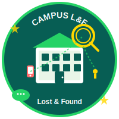

# 🎓 Campus Lost & Found

<div align="center">



**A comprehensive Flutter application for Walter Sisulu University students to report, find, and recover lost items across campus.**

[](https://flutter.dev/)
[](https://firebase.google.com/)
[](LICENSE)
[](https://flutter.dev/)

</div>

## 📋 Table of Contents

- [Overview](#-overview)
- [Features](#-features)
- [Screenshots](#-screenshots)
- [Tech Stack](#-tech-stack)
- [Getting Started](#-getting-started)
- [Installation](#-installation)
- [Configuration](#-configuration)
- [Usage](#-usage)
- [Project Structure](#-project-structure)
- [Contributing](#-contributing)
- [License](#-license)
- [Support](#-support)

## 🌟 Overview

Campus Lost & Found is a modern, feature-rich mobile and web application designed specifically for Walter Sisulu University students. The app provides a centralized platform for reporting lost items, discovering found items, and facilitating communication between students to recover lost belongings efficiently.

### 🎯 Mission
To reduce the time students spend searching for lost items and improve collaboration among the campus community through a safe, user-friendly digital platform.

## ✨ Features

### 🔐 **Authentication & Security**
- Firebase Authentication integration
- Secure user registration and login
- Profile management with student verification
- Privacy-focused data handling

### 📱 **Core Functionality**
- **Report Lost Items**: Submit detailed reports with photos, descriptions, and location data
- **Browse Found Items**: Search through a comprehensive database of found items
- **Advanced Search & Filters**: Filter by category, location, date, and status
- **Real-time Updates**: Instant notifications when matching items are found

### 💬 **Communication Features**
- **In-app Messaging**: WhatsApp-style chat interface for secure communication
- **Video & Voice Calls**: WebRTC-powered real-time communication
- **Typing Indicators**: Real-time typing status and message delivery confirmation
- **Media Sharing**: Send images and attachments within conversations

### 🎨 **User Experience**
- **Modern UI/UX**: Material 3 design with WhatsApp-inspired aesthetics
- **Theme Support**: Light, dark, and system theme options
- **Responsive Design**: Optimized for mobile, tablet, and web platforms
- **Accessibility**: Screen reader support and keyboard navigation

### 🤖 **AI Integration**
- **Smart Chatbot**: AI-powered assistant for quick help and guidance
- **Intelligent Matching**: Automated suggestions for potential item matches
- **Natural Language Processing**: Enhanced search capabilities

### 📊 **Management Tools**
- **Personal Dashboard**: Manage your reported and found items
- **Analytics**: Track success rates and popular categories
- **Admin Panel**: Moderation tools for campus administrators

## 📸 Screenshots

<div align="center">

| Home Page | Chat Interface | Video Call |
|-----------|----------------|------------|
|  |  |  |

| Search & Filter | Profile Management | Settings |
|-----------------|-------------------|----------|
|  |  |  |

</div>

## 🛠 Tech Stack

### **Frontend**
- **Flutter 3.0+**: Cross-platform UI framework
- **Material 3**: Modern design system
- **Google Fonts**: Typography (Poppins)
- **Flutter SVG**: Vector graphics support

### **Backend & Services**
- **Firebase Authentication**: User management and security
- **Cloud Firestore**: Real-time NoSQL database
- **Firebase Storage**: File and image storage
- **Firebase Cloud Messaging**: Push notifications

### **Real-time Communication**
- **WebRTC**: Peer-to-peer video and voice calling
- **Socket.IO**: Real-time messaging infrastructure
- **Firebase Realtime Database**: Live chat synchronization

### **Development Tools**
- **Dart**: Programming language
- **VS Code**: Recommended IDE
- **Firebase CLI**: Project management
- **FlutterFire**: Firebase integration

## 🚀 Getting Started

### Prerequisites

Before you begin, ensure you have the following installed:

- **Flutter SDK** (3.0 or higher)
- **Dart SDK** (included with Flutter)
- **Android Studio** (for Android development)
- **Xcode** (for iOS development, macOS only)
- **Node.js** (for Firebase CLI)
- **Git** (version control)

### System Requirements

| Platform | Minimum Version |
|----------|----------------|
| Android | API 21 (Android 5.0) |
| iOS | iOS 11.0 |
| Web | Chrome 84+, Safari 14+, Firefox 78+ |

## 📦 Installation

### 1. Clone the Repository

```bash
git clone https://github.com/yourusername/campus_lf_app.git
cd campus_lf_app
```

### 2. Install Dependencies

```bash
flutter pub get
```

### 3. Verify Installation

```bash
flutter doctor
```

Ensure all checkmarks are green before proceeding.

## ⚙️ Configuration

### Firebase Setup

1. **Create Firebase Project**
   ```bash
   # Install Firebase CLI
   npm install -g firebase-tools
   
   # Login to Firebase
   firebase login
   ```

2. **Configure FlutterFire**
   ```bash
   # Install FlutterFire CLI
   dart pub global activate flutterfire_cli
   
   # Configure Firebase for your project
   flutterfire configure
   ```

3. **Enable Firebase Services**
   - Authentication (Email/Password, Google Sign-in)
   - Cloud Firestore
   - Firebase Storage
   - Cloud Messaging (optional)

### Environment Configuration

Create a `.env` file in the project root:

```env
# Firebase Configuration
FIREBASE_PROJECT_ID=your-project-id
FIREBASE_API_KEY=your-api-key
FIREBASE_AUTH_DOMAIN=your-auth-domain

# App Configuration
APP_NAME=Campus Lost & Found
UNIVERSITY_NAME=Walter Sisulu University
SUPPORT_EMAIL=support@campuslf.com
```

## 🎮 Usage

### Development

```bash
# Run on Chrome (Web)
flutter run -d chrome --web-port=8080

# Run on Android
flutter run -d android

# Run on iOS (macOS only)
flutter run -d ios
```

### Building for Production

```bash
# Build for Web
flutter build web --release

# Build for Android
flutter build apk --release
flutter build appbundle --release

# Build for iOS
flutter build ios --release
```

### Testing

```bash
# Run unit tests
flutter test

# Run integration tests
flutter test integration_test/

# Run with coverage
flutter test --coverage
```

## 📁 Project Structure

```
campus_lf_app/
├── 📁 lib/
│   ├── 📄 main.dart                 # App entry point
│   ├── 📄 app.dart                  # Main app configuration
│   ├── 📄 models.dart               # Data models
│   ├── 📄 firebase_options.dart     # Firebase configuration
│   └── 📁 pages/
│       ├── 📄 home_page.dart        # Home dashboard
│       ├── 📄 report_page.dart      # Report lost/found items
│       ├── 📄 search_page.dart      # Search and filter
│       ├── 📄 my_reports_page.dart  # User's reports
│       ├── 📄 chat_page.dart        # Messaging interface
│       ├── 📄 video_call_page.dart  # Video calling
│       ├── 📄 profile_page.dart     # User profile
│       ├── 📄 settings_page.dart    # App settings
│       ├── 📄 about_page.dart       # About information
│       ├── 📄 manual_page.dart      # User manual
│       └── 📄 chatbot_page.dart     # AI assistant
├── 📁 web/
│   ├── 🖼️ logo.svg                 # App logo
│   ├── 🖼️ app_icon.svg             # App icon
│   └── 📄 index.html               # Web entry point
├── 📁 docs/
│   ├── 📄 ARCHITECTURE.md          # Technical architecture
│   ├── 📄 API_DOCUMENTATION.md     # API reference
│   ├── 📄 USER_GUIDE.md            # User manual
│   ├── 📄 DEPLOYMENT.md            # Deployment guide
│   └── 📄 CONTRIBUTING.md          # Contribution guidelines
├── 📁 test/
│   └── 📄 widget_test.dart         # Unit tests
├── 📄 pubspec.yaml                 # Dependencies
├── 📄 firebase.json                # Firebase configuration
└── 📄 README.md                    # This file
```

## 🤝 Contributing

We welcome contributions from the community! Please read our [Contributing Guidelines](docs/CONTRIBUTING.md) for details on:

- Code of Conduct
- Development workflow
- Coding standards
- Pull request process
- Issue reporting

### Quick Start for Contributors

1. Fork the repository
2. Create a feature branch (`git checkout -b feature/amazing-feature`)
3. Commit your changes (`git commit -m 'Add amazing feature'`)
4. Push to the branch (`git push origin feature/amazing-feature`)
5. Open a Pull Request

## 📄 License

This project is licensed under the MIT License - see the [LICENSE](LICENSE) file for details.

## 🆘 Support

### Documentation
- [User Guide](docs/USER_GUIDE.md) - Comprehensive user manual
- [API Documentation](docs/API_DOCUMENTATION.md) - Technical API reference
- [Architecture Guide](docs/ARCHITECTURE.md) - System design overview

### Getting Help
- 📧 **Email**: support@campuslf.com
- 🐛 **Bug Reports**: [GitHub Issues](https://github.com/yourusername/campus_lf_app/issues)
- 💬 **Discussions**: [GitHub Discussions](https://github.com/yourusername/campus_lf_app/discussions)
- 📚 **Wiki**: [Project Wiki](https://github.com/yourusername/campus_lf_app/wiki)

### Community
- 🎓 **University**: Walter Sisulu University
- 👥 **Student Community**: WSU Lost & Found Group
- 🔗 **Social Media**: [@CampusLostFound](https://twitter.com/campuslostfound)

---

<div align="center">

**Made with ❤️ for Walter Sisulu University students**

*Helping students find what matters most*

</div>
